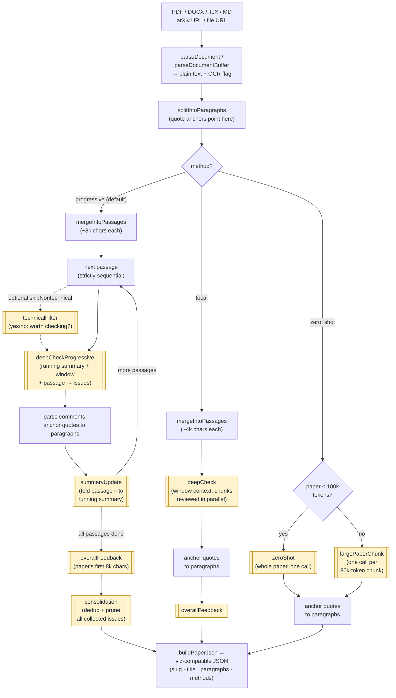

# reviewer2

AI-powered academic paper reviewer for Node/TypeScript — the reviewer #2
every paper deserves. A port of
[OpenAIReview](https://github.com/ChicagoHAI/OpenAIReview) (Python) designed
for web-app integration: every pipeline returns structured,
**visualization-ready JSON**, and the long-running review is exposed as
JSON-safe steps that drop into [Inngest](https://www.inngest.com/) (or any
durable-execution runtime).

## Install

```bash
npm install reviewer2
```

Node ≥ 20, ESM and CJS builds included.

## Quick start

```ts
import { parseDocument, reviewPaper } from "reviewer2";

// 1. Get the paper text (PDF/DOCX/TeX/MD file, or an arXiv URL)
const doc = await parseDocument("paper.pdf"); // or parseDocumentBuffer(bytes, "pdf")

// 2. Review it — returns viz-compatible JSON
const { paper, result } = await reviewPaper(doc.text, {
  title: doc.title,
  ocr: doc.wasOcr,
  method: "progressive",              // default; also: zero_shot | local
  model: "gpt-5.2",                   // default depends on provider
  onProgress: (e) => console.log(e),  // { stage: "passage", current, total, ... }
});

console.log(JSON.stringify(paper, null, 2));
```

## API keys

There are two ways to provide keys — pick per call site:

**1. Environment variables** (simplest — set one and every call just works):

```bash
export OPENAI_API_KEY=sk-...        # OpenAI (default provider)
# or any of:
export OPENROUTER_API_KEY=sk-or-... # OpenRouter (any model id)
export ANTHROPIC_API_KEY=sk-ant-...
export GEMINI_API_KEY=...
```

The package reads `process.env` directly and does **not** load `.env` files
itself — Next.js loads `.env.local` automatically; in plain Node use
`node --env-file=.env` or `dotenv`.

**2. Explicit options** (no env vars needed — for multi-tenant apps passing
per-user/per-workspace keys):

```ts
await reviewPaper(text, {
  provider: "openrouter",              // openai | openrouter | anthropic | gemini
  apiKey: user.openrouterKey,
  model: "anthropic/claude-opus-4-6",
});
```

| Provider | Env var | Notes |
|---|---|---|
| **OpenAI** (default) | `OPENAI_API_KEY` | `OPENAI_BASE_URL` env or `baseUrl` option for Azure/EU/proxies |
| OpenRouter | `OPENROUTER_API_KEY` | any model id, e.g. `anthropic/claude-opus-4-6` |
| Anthropic | `ANTHROPIC_API_KEY` | native API |
| Google Gemini | `GEMINI_API_KEY` | native API |

**Which provider gets used** (first match wins):

1. Explicit `provider` option
2. `REVIEW_PROVIDER` env var (e.g. `REVIEW_PROVIDER=openrouter`)
3. Vendor-prefixed model id — `model: "anthropic/..."` uses the Anthropic
   native API when `ANTHROPIC_API_KEY` is set
4. First available key, in order: **OpenAI**, OpenRouter, Anthropic, Gemini

If a `model` isn't specified, each provider has a sensible default (OpenAI →
`gpt-5.2`, OpenRouter → `anthropic/claude-opus-4-6`, …). Missing or
misconfigured keys throw a `ProviderError` with a message saying exactly
which env var to set.

## Output JSON contract

`reviewPaper` returns `paper: PaperReviewJson` — the exact shape the original
Python tool's visualization consumes, so a web UI can be built directly
against it:

```jsonc
{
  "slug": "my-paper",
  "title": "My Paper Title",
  "paragraphs": [ { "index": 0, "text": "…" } ],       // for highlighting
  "methods": {
    "progressive__gpt-5.2": {
      "label": "Progressive (gpt-5.2)",
      "model": "gpt-5.2",
      "overall_feedback": "One-paragraph assessment…",
      "comments": [
        {
          "id": "progressive__gpt-5.2_0",
          "title": "Sign error in Eq. 3",
          "quote": "exact flagged text from the paper",
          "explanation": "reviewer's reasoning…",
          "comment_type": "technical",                 // or "logical"
          "paragraph_index": 12                        // anchors to paragraphs[12]
        }
      ],
      "cost_usd": 0.155,
      "prompt_tokens": 3088,
      "completion_tokens": 5590
    }
  }
}
```

`paragraph_index` anchors each comment to a paragraph for in-context
highlighting (fuzzy quote matching, ported from the Python implementation).
An optional `severity` field (`major`/`moderate`/`minor`) is understood by the
viz if you add your own tiering pass.

## How it works

The flowchart below traces a paper through the pipeline. Every shaded
double-bordered node is **one LLM call**, labeled with the name of its
prompt template — each one is an injection point for the
[`prompts` option](#customizing-prompts): right before the call, the
builder resolves the effective template (template override > block
override > default) and interpolates the placeholders.



**Why `splitIntoParagraphs` matters:** it's computed once, deterministically
(split on blank lines; fragments under 100 chars merge into the next
paragraph so headings and stray lines don't stand alone), and everything
downstream is expressed in its coordinates. The output JSON's `paragraphs`
array is this exact list; review passages are merges of adjacent paragraphs
that remember their indices; and since LLMs return quotes rather than
positions, each comment's quote is fuzzy-matched back to a paragraph to set
`paragraph_index` — the anchor a UI uses to highlight where in the paper a
comment points.

Which prompt runs where, at a glance:

| Prompt template | Used by | Purpose |
|---|---|---|
| `deepCheckProgressive` | progressive | The core review call — finds issues in one passage given the running summary + surrounding context |
| `summaryUpdate` | progressive | Maintains the running summary of definitions/equations/claims |
| `consolidation` | progressive | Final dedup/prune over all collected issues |
| `technicalFilter` | progressive (opt-in) | Cheap yes/no gate to skip non-technical passages |
| `deepCheck` | local | Per-chunk review with window context only |
| `overallFeedback` | progressive + local | One-paragraph assessment from the paper's opening |
| `zeroShot` | zero_shot | Whole paper in a single prompt |
| `largePaperChunk` | zero_shot (>100k tokens) | Per-chunk fallback for very long papers |

## Review methods

Pick with the `method` option on `reviewPaper`. **Default: `progressive`** —
the highest-quality method and the one the original project's benchmarks are
built around.

| Method | How it reads the paper | LLM calls | Speed / cost | Reach for it when |
|---|---|---|---|---|
| **`progressive`** (default) | Sequentially, like a careful reviewer: maintains a running summary of definitions, equations, and claims, deep-checks each ~8k-char passage against that accumulated context, then a final consolidation pass dedups and prunes weak issues | 2 per passage + feedback + consolidation (strictly sequential) | Slowest — minutes to tens of minutes | You want the best review; catches cross-section inconsistencies (e.g. a number in §5 contradicting Table 2) that per-chunk methods miss |
| **`local`** | Each ~4k-char chunk independently, with a window of surrounding chunks as context — no memory of the rest of the paper, no dedup pass | 1 per chunk + feedback (parallel, `concurrency` option, default 4) | Middle | You want passage-level scrutiny fast and can tolerate some duplicate/local-only findings |
| **`zero_shot`** | The whole paper in one prompt (auto-chunks above ~100k tokens) | 1 (or 1 per 80k-token chunk) | Fastest, cheapest | Quick triage or a cheap first pass |

How they differ in practice: `progressive` is the only method that carries
memory across the paper (the running summary), which is where the
hardest-to-spot issues live — notation drift, parameter values contradicting
earlier tables, overclaims relative to what was actually shown. `local` trades
that global memory for parallelism; `zero_shot` trades depth for a single
cheap call.

**Why not just one big prompt?** `zero_shot` gives the model all the
information, but having it in context isn't the same as using it:

- **Attention dilutes** over long context — a single pass over 50k tokens
  skims and reports only the most salient issues ("lost in the middle").
  Progressive re-focuses full attention on one ~8k-char passage at a time.
- **The output budget doesn't scale** — one call means one answer for the
  whole paper, so the model self-truncates to a top-N list. Progressive
  gives every passage its own response budget.
- **Cross-references stay implicit** — catching "§5 contradicts Table 2"
  in one pass requires spontaneously connecting facts 40 pages apart.
  The running summary re-presents every definition and claimed value next
  to each new passage, turning long-range contradictions into short-range
  collisions.
- **No second chance** — progressive over-generates per passage and lets
  the consolidation pass prune; whatever a single call misses stays missed.

The trade-off is real: `zero_shot` is ~35× fewer calls, which is why it
exists for triage.

For scale: a 25-page paper through `progressive` with `gpt-5-mini` is ~35 LLM
calls, ~10 minutes, ≈$0.10. The same paper through `zero_shot` is one call.

`progressive` also returns the pre-consolidation comments as a separate
`progressive_original` method block in the output JSON, so a UI can show
"all raw findings" vs "consolidated" side by side.

## Document parsing

```ts
import { parseDocumentBuffer } from "reviewer2";

const parsed = await parseDocumentBuffer(pdfBytes, "pdf", {
  maxPages: 30, // optional input-size cap
});
// parsed = { title, text, wasOcr, ocrEngine, ocrCorrections }
```

- **PDF** — pure-JS `unpdf` (pdf.js) with paragraph reflow and dehyphenation;
  OCR notation auto-correction is applied. Math symbols are not preserved —
  for math-heavy papers prefer LaTeX source, markdown, or arXiv HTML, or run
  your own OCR and feed the extracted text to `reviewPaper` directly.
- **DOCX** (mammoth), **LaTeX**, **TXT/MD** (frontmatter-aware).
- **arXiv** — `parseDocument("https://arxiv.org/abs/2310.06825")` parses the
  HTML version and falls back to the PDF.
- **Any file URL** — `parseDocument("https://…/paper.pdf?X-Amz-Signature=…")`
  fetches and routes by path extension or `Content-Type` (presigned S3/GCS
  links work; extension-less PDF URLs are detected via `Content-Type`).

Pass `ocr: parsed.wasOcr` to `reviewPaper` so prompts include the OCR caveat.

## Customizing prompts

Every prompt is customizable via the `prompts` option, at two levels. Both
are plain strings — JSON-safe, so custom prompts can be stored per
user/track in a database and passed through Inngest step boundaries.

**1. Block overrides** — replace one shared building block, keep the prompt
structure. The most common tweak is the check criteria:

```ts
await reviewPaper(text, {
  prompts: {
    blocks: {
      checkCriteria: `Check for:
1. Statistical validity: p-hacking, underpowered samples, wrong tests
2. Reproducibility: missing data/code availability, underspecified methods
3. Overclaiming relative to the evidence presented`,
    },
  },
});
```

Available blocks: `reviewerPreamble`, `checkCriteria`, `explanationStyle`,
`leniencyRules`, `doNotFlag`, `ocrCaveat`, `jsonArrayOutput` — see
`DEFAULT_PROMPT_BLOCKS` for the default text of each.

**2. Template overrides** — replace an entire prompt. Templates use
`{placeholder}` interpolation (single-pass, so LaTeX braces in paper text
are never mangled; unknown placeholders are left as-is):

```ts
await reviewPaper(text, {
  prompts: {
    templates: {
      overallFeedback: `You are a harsh but fair Reviewer #2. In one paragraph,
assess the paper below and name its single biggest weakness.

PAPER (beginning):
{paperStart}`,
    },
  },
});
```

**A completely different review prompt** — replace `deepCheckProgressive`
(the main prompt of the default method). Reuse the default output-format
block so the built-in parser still understands the response:

```ts
import { DEFAULT_PROMPT_BLOCKS, reviewPaper } from "reviewer2";

const empiricalDeepCheck = `You are a methodologist reviewing an empirical
social-science paper. Today's date is {currentDate}.

{ocrCaveat}
CONTEXT (running summary + surrounding sections):
{context}

---

PASSAGE TO CHECK:
{passage}

---

Check ONLY for:
1. Identification problems: confounds, selection, reverse causality
2. Statistical issues: wrong test, multiple comparisons, p-hacking signs
3. Measurement validity: does the variable measure the claimed construct?
4. External validity claims beyond the sample

${DEFAULT_PROMPT_BLOCKS.jsonArrayOutput}`;

await reviewPaper(text, {
  prompts: { templates: { deepCheckProgressive: empiricalDeepCheck } },
});
```

**Switching prompt sets per run** — because overrides are plain JSON, you
can keep named presets (in code or a DB row) and pick one per paper/track:

```ts
import type { PromptOverrides } from "reviewer2";

const PRESETS: Record<string, PromptOverrides> = {
  theoretical: {},                                    // package defaults
  empirical: {
    blocks: { checkCriteria: "Check for:\n1. Statistical validity…" },
  },
  strict: {
    blocks: { leniencyRules: "Be lenient with nothing. Flag every issue." },
  },
};

await reviewPaper(text, { prompts: PRESETS[track.reviewStyle] });
```

| Template | Placeholders |
|---|---|
| `deepCheck` / `deepCheckProgressive` | `{currentDate}` `{ocrCaveat}` `{context}` `{passage}` |
| `zeroShot` | `{currentDate}` `{ocrCaveat}` `{paperText}` |
| `largePaperChunk` | `{currentDate}` `{ocrCaveat}` `{chunkNum}` `{totalChunks}` `{chunkText}` |
| `summaryUpdate` | `{currentSummary}` `{passageText}` `{passageIdx}` `{totalPassages}` |
| `technicalFilter` | `{passage}` (answer must be exactly "yes"/"no") |
| `consolidation` | `{issuesJson}` |
| `overallFeedback` | `{paperStart}` |

Precedence: template override > block override > default. Inspect the
defaults with `defaultPromptTemplates()` / `DEFAULT_PROMPT_BLOCKS` and use
`resolvePromptTemplates(overrides)` to preview the effective prompts.

⚠️ If you rewrite a template that asks for JSON (`deepCheck*`, `zeroShot`,
`largePaperChunk`, `consolidation`), keep the requested output shape —
items with `title` / `quote` / `explanation` / `type` — or the built-in
parser won't extract comments. `technicalFilter` must keep the yes/no
answer contract.

## Cost tracking

`cost_usd` in the output is computed from a built-in static pricing table
(USD per 1M tokens). For fresh prices, fetch a live table and pass it through:

```ts
import { fetchLivePricing, reviewPaper } from "reviewer2";

const pricing = await fetchLivePricing();          // LiteLLM community DB (default)
// or: await fetchLivePricing({ source: "openrouter" })  // OpenRouter /models API
const { paper } = await reviewPaper(text, { ...options, pricing });
```

`fetchLivePricing` caches in memory (24 h TTL by default) and **never
throws** — on failure it returns the last cached table or the static one,
so a pricing outage can't break a review. `computeCost(result, pricing?)`
accepts the same table directly. Model lookup is longest-match, so
`gpt-5-mini` resolves to its own entry rather than `gpt-5`.

## Long-running reviews in a Next.js app (Inngest)

A real review runs 20–60+ minutes — far beyond any serverless timeout. Don't
run it in a route handler; run it as a chain of **durable steps** and treat the
route as enqueue + status:

```
POST /api/reviews → DB row → inngest.send()          (returns 202 instantly)
Inngest fn: prepare → passage-0…N → feedback → consolidate → save JSON
GET /api/reviews?id → { status, progress, result? }  (poll or Inngest Realtime)
```

The `reviewer2/steps` entry point exposes the pipeline as step-sized,
JSON-serializable functions, so each passage becomes its own retryable,
checkpointed `step.run` — a failure at passage 37 never re-pays for passages
0–36:

```ts
import {
  prepareProgressive, runProgressivePassage,
  generateOverallFeedback, consolidateComments, buildPaperJson,
} from "reviewer2/steps";

const plan = await step.run("prepare", () => prepareProgressive(text));
let summary = "";
const all = [];
for (let i = 0; i < plan.passages.length; i++) {
  const out = await step.run(`passage-${i}`, () =>
    runProgressivePassage({ plan, passageIndex: i, runningSummary: summary, options }));
  summary = out.updatedSummary;
  all.push(...out.comments);
}
const feedback = await step.run("feedback", () => generateOverallFeedback(text, options));
const final = await step.run("consolidate", () => consolidateComments(all, options));
const paper = buildPaperJson({ slug, title, paragraphs: plan.paragraphs, results: [/*…*/] });
```

See **[`examples/inngest/`](examples/inngest/)** for the complete function,
route handlers, progress reporting, and the step-state rules (4 MB step
output cap, JSON-only state, pinned `currentDate` for deterministic retries).

## Building a UI

This package is headless — it produces JSON, and your app owns the UI. Build
against the [output JSON contract](#output-json-contract) above:
`paragraphs` renders the paper, each comment's `paragraph_index` drives
highlighting/scroll-to, and `methods` supports side-by-side model comparison.

For reference, `examples/viz/index.html` (the original project's single-file
viewer, not published to npm) is a complete consumer of this JSON — useful
for eyeballing results during development or as a starting point for your own
components.

## Development

```bash
npm install
npm test          # vitest (35 tests, no API calls)
npm run build     # tsup → dist/ (ESM + CJS + d.ts)
npm run typecheck
```

## What reviewer2 adds on top of OpenAIReview

The review pipeline, prompts, and output contract are a faithful port. On
top of that, reviewer2 adds what a Node/TypeScript web app needs:

**Integration & API**
- **JSON-first API** — `reviewPaper()` returns the viz-compatible JSON
  directly as a typed object; no CLI, no result files to read back.
- **Step API for durable execution** (`reviewer2/steps`) — the progressive
  pipeline decomposed into JSON-safe step functions
  (`prepareProgressive` / `runProgressivePassage` / `consolidateComments` /
  `buildPaperJson`) that drop into Inngest `step.run` with checkpointed
  retries; `currentDate` can be pinned so retried steps build identical
  prompts. Includes a complete Next.js + Inngest example.
- **Structured progress events** — an `onProgress` callback
  (`prepared` / `passage` / `consolidation` / `done`) instead of stdout
  prints, ready to drive a progress UI.
- **`AbortSignal` cancellation** through the client, parsers, and methods.

**Providers**
- **OpenAI as the default provider** (the original prefers OpenRouter),
  alongside OpenRouter, Anthropic, and Gemini (any other vendor's models
  are reachable through OpenRouter).
- **Explicit `{ provider, apiKey }` injection** — no env vars required, so
  multi-tenant apps can pass per-user keys.
- **GPT-5 / o-series handling** — `max_completion_tokens` and no explicit
  `temperature` for OpenAI reasoning models (the original errors on these).

**Inputs**
- **Buffer-based parsing** (`parseDocumentBuffer`) for files already in
  memory (e.g. downloaded from S3) — no filesystem needed.
- **Any file URL as input** — presigned S3/GCS links, extension-less PDF
  URLs (routed by `Content-Type`), not just arXiv URLs.
- **Pure-JS PDF extraction** (`unpdf` + line-reflow paragraph
  reconstruction and dehyphenation) instead of native PyMuPDF, so it runs
  in serverless environments with no system dependencies.

**Cost**
- **Live pricing** — `fetchLivePricing()` pulls current per-model prices
  from LiteLLM's community DB or the OpenRouter API (cached, never throws),
  and pricing tables are injectable into `computeCost`/`reviewPaper`;
  model lookup is longest-match instead of table-order-dependent.

**Performance**
- **Concurrent chunk review** for the `local` method and chunked
  `zero_shot` (`concurrency` option); the original runs strictly
  sequentially.

## Agent skill

Prefer running reviews inside an AI coding agent instead of integrating the
library? **[harrywang/reviewer2-skill](https://github.com/harrywang/reviewer2-skill)**
packages the same review pipeline as an agent skill for Claude Code, Cursor,
Codex, and others — install with `npx skills add harrywang/reviewer2-skill`,
then run `/reviewer2 paper.pdf`. It produces the same viz-compatible JSON and
bundles a local web viewer.

## Credits

reviewer2 is a TypeScript port of
**[OpenAIReview](https://github.com/ChicagoHAI/OpenAIReview)** by
[ChicagoHAI](https://github.com/ChicagoHAI) (MIT licensed), which originated
the review pipeline design (progressive summary-based review, deep-check
prompts, consolidation), the prompt set, the fuzzy quote-to-paragraph
anchoring, and the reference viewer (`examples/viz/index.html` is taken
directly from it).

## License

MIT
