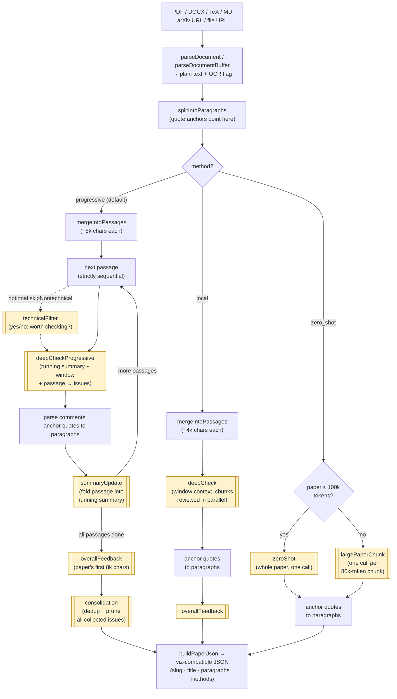

# How reviewer2 works

The output contract, the review pipeline, and how the methods differ.
Back to the [README](../README.md).

## Output JSON contract

`reviewPaper` returns `paper: PaperReviewJson` — the exact shape the original
Python tool's visualization consumes, so a web UI can be built directly
against it:

```jsonc
{
  "slug": "my-paper",
  "title": "My Paper Title",
  "paragraphs": [ { "index": 0, "text": "…" } ],       // for highlighting
  "methods": {
    "progressive__gpt-5.2": {
      "label": "Progressive (gpt-5.2)",
      "model": "gpt-5.2",
      "overall_feedback": "One-paragraph assessment…",
      "comments": [
        {
          "id": "progressive__gpt-5.2_0",
          "title": "Sign error in Eq. 3",
          "quote": "exact flagged text from the paper",
          "explanation": "reviewer's reasoning…",
          "comment_type": "technical",                 // or "logical" / "reference"
          "paragraph_index": 12                        // anchors to paragraphs[12]
        }
      ],
      "cost_usd": 0.155,
      "prompt_tokens": 3088,
      "completion_tokens": 5590
    }
  }
}
```

`paragraph_index` anchors each comment to a paragraph for in-context
highlighting (fuzzy quote matching, ported from the Python implementation).
An optional `severity` field (`major`/`moderate`/`minor`) is understood by the
viz if you add your own tiering pass.

## The pipeline

The flowchart below traces a paper through the pipeline. Every shaded
double-bordered node is **one LLM call**, labeled with the name of its
prompt template — each one is an injection point for the
[`prompts` option](./prompts.md): right before the call, the
builder resolves the effective template (template override > block
override > default) and interpolates the placeholders.



**Why `splitIntoParagraphs` matters:** it's computed once, deterministically
(split on blank lines; fragments under 100 chars merge into the next
paragraph so headings and stray lines don't stand alone), and everything
downstream is expressed in its coordinates. The output JSON's `paragraphs`
array is this exact list; review passages are merges of adjacent paragraphs
that remember their indices; and since LLMs return quotes rather than
positions, each comment's quote is fuzzy-matched back to a paragraph to set
`paragraph_index` — the anchor a UI uses to highlight where in the paper a
comment points.

Which prompt runs where, at a glance:

| Prompt template | Used by | Purpose |
|---|---|---|
| `deepCheckProgressive` | progressive | The core review call — finds issues in one passage given the running summary + surrounding context |
| `summaryUpdate` | progressive | Maintains the running summary of definitions/equations/claims |
| `consolidation` | progressive | Final dedup/prune over all collected issues |
| `technicalFilter` | progressive (opt-in) | Cheap yes/no gate to skip non-technical passages |
| `deepCheck` | local | Per-chunk review with window context only |
| `overallFeedback` | progressive + local | One-paragraph assessment from the paper's opening |
| `zeroShot` | zero_shot | Whole paper in a single prompt |
| `largePaperChunk` | zero_shot (>100k tokens) | Per-chunk fallback for very long papers |
| `referenceLocator` / `referenceExtraction` / `referenceVerdict` | [reference check](./reference-check.md) (opt-in) | Locate + parse the bibliography; adjudicate ambiguous matches |

## Review methods

Pick with the `method` option on `reviewPaper`. **Default: `progressive`** —
the highest-quality method and the one the original project's benchmarks are
built around.

| Method | How it reads the paper | LLM calls | Speed / cost | Reach for it when |
|---|---|---|---|---|
| **`progressive`** (default) | Sequentially, like a careful reviewer: maintains a running summary of definitions, equations, and claims, deep-checks each ~8k-char passage against that accumulated context, then a final consolidation pass dedups and prunes weak issues | 2 per passage + feedback + consolidation (strictly sequential) | Slowest — minutes to tens of minutes | You want the best review; catches cross-section inconsistencies (e.g. a number in §5 contradicting Table 2) that per-chunk methods miss |
| **`local`** | Each ~4k-char chunk independently, with a window of surrounding chunks as context — no memory of the rest of the paper, no dedup pass | 1 per chunk + feedback (parallel, `concurrency` option, default 4) | Middle | You want passage-level scrutiny fast and can tolerate some duplicate/local-only findings |
| **`zero_shot`** | The whole paper in one prompt (auto-chunks above ~100k tokens) | 1 (or 1 per 80k-token chunk) | Fastest, cheapest | Quick triage or a cheap first pass |

How they differ in practice: `progressive` is the only method that carries
memory across the paper (the running summary), which is where the
hardest-to-spot issues live — notation drift, parameter values contradicting
earlier tables, overclaims relative to what was actually shown. `local` trades
that global memory for parallelism; `zero_shot` trades depth for a single
cheap call.

**Why not just one big prompt?** `zero_shot` gives the model all the
information, but having it in context isn't the same as using it:

- **Attention dilutes** over long context — a single pass over 50k tokens
  skims and reports only the most salient issues ("lost in the middle").
  Progressive re-focuses full attention on one ~8k-char passage at a time.
- **The output budget doesn't scale** — one call means one answer for the
  whole paper, so the model self-truncates to a top-N list. Progressive
  gives every passage its own response budget.
- **Cross-references stay implicit** — catching "§5 contradicts Table 2"
  in one pass requires spontaneously connecting facts 40 pages apart.
  The running summary re-presents every definition and claimed value next
  to each new passage, turning long-range contradictions into short-range
  collisions.
- **No second chance** — progressive over-generates per passage and lets
  the consolidation pass prune; whatever a single call misses stays missed.

The trade-off is real: `zero_shot` is ~35× fewer calls, which is why it
exists for triage.

For scale: a 25-page paper through `progressive` with `gpt-5-mini` is ~35 LLM
calls, ~10 minutes, ≈$0.10. The same paper through `zero_shot` is one call.

`progressive` also returns the pre-consolidation comments as a separate
`progressive_original` method block in the output JSON, so a UI can show
"all raw findings" vs "consolidated" side by side.

## Building a UI

This package is headless — it produces JSON, and your app owns the UI. Build
against the [output JSON contract](#output-json-contract) above:
`paragraphs` renders the paper, each comment's `paragraph_index` drives
highlighting/scroll-to, and `methods` supports side-by-side model comparison.

For reference, `examples/viz/index.html` (the original project's single-file
viewer, not published to npm) is a complete consumer of this JSON — useful
for eyeballing results during development or as a starting point for your own
components.
